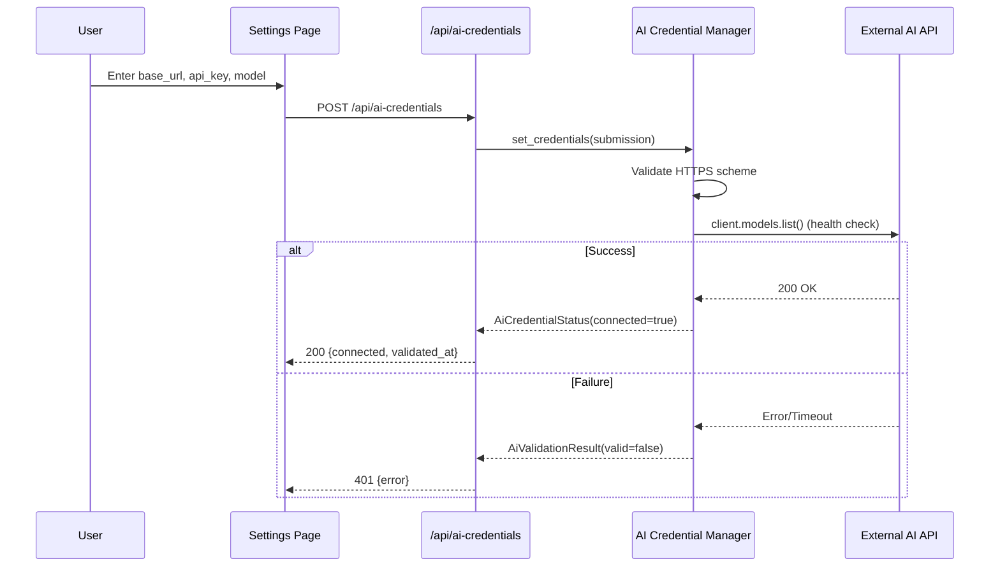
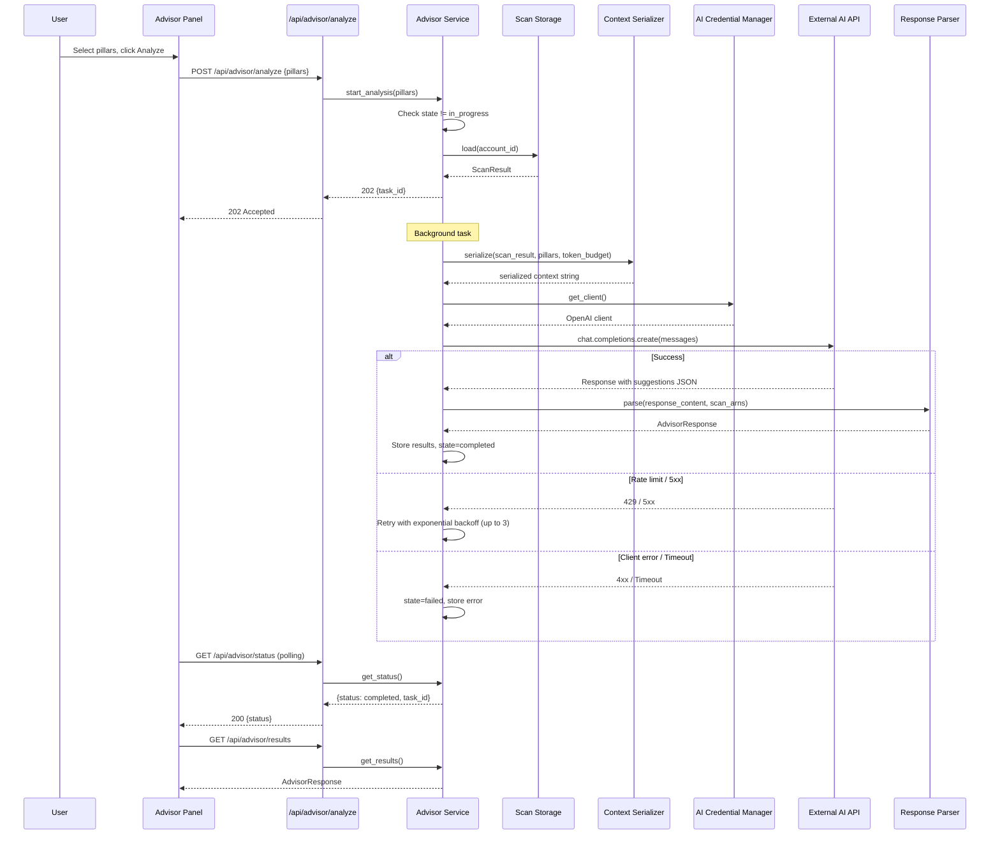

# Design Document: AI Architecture Advisor

## Overview

The AI Architecture Advisor integrates an external OpenAI-compatible AI API into CloudSpyglass to analyze scanned AWS infrastructure and produce structured architecture recommendations. The feature adds a credential management layer for AI API keys (separate from AWS credentials), a context serializer that converts scan results into token-budget-aware prompts, an advisor service that orchestrates the AI call lifecycle with retry logic, and a response parser that validates AI output into typed suggestions. The frontend adds a collapsible AI credentials section on the Settings page and a dedicated Advisor Panel with pillar selection, status polling, and results display.

The backend follows the existing FastAPI + Pydantic pattern with in-memory singletons in `dependencies.py`. The frontend follows the existing React 19 + Vite + TypeScript pattern using the shared `apiClient`.

## Architecture

```mermaid
graph TD
    subgraph Frontend
        SP[Settings Page] --> ACS[AI Credentials Section]
        AP[Advisor Panel] --> PS[Pillar Selector]
        AP --> SD[Status Display]
        AP --> RD[Results Display]
    end

    subgraph Backend Routes
        ACR[/api/ai-credentials] 
        ADV[/api/advisor/analyze]
        ADVS[/api/advisor/status]
        ADVR[/api/advisor/results]
    end

    subgraph Backend Services
        ACM[AI Credential Manager]
        AS[Advisor Service]
        CS[Context Serializer]
        RP[Response Parser]
        SS[Scan Storage]
    end

    subgraph External
        AI[OpenAI-compatible API]
    end

    ACS --> ACR
    AP --> ADV
    AP --> ADVS
    AP --> ADVR

    ACR --> ACM
    ACM --> AI

    ADV --> AS
    ADVS --> AS
    ADVR --> AS

    AS --> CS
    AS --> ACM
    AS --> RP
    AS --> SS
    AS --> AI
    CS --> SS
```

## Sequence Diagrams

### AI Credential Setup Flow



### Architecture Analysis Flow



## Components and Interfaces

### Component 1: AI Credential Manager

**Purpose**: Manages AI API credentials in-memory with validation via health check. Follows the same singleton pattern as the existing `CredentialManager`.

```python
from pydantic import BaseModel, Field
from openai import AsyncOpenAI

class AiCredentialSubmission(BaseModel):
    base_url: str = Field(..., max_length=512)
    api_key: str = Field(..., max_length=512)
    model: str = Field(..., max_length=256)

class AiCredentialStatus(BaseModel):
    connected: bool
    source: str  # "custom" | "environment"
    model: str | None = None
    validated_at: str | None = None  # ISO 8601

class AiValidationResult(BaseModel):
    valid: bool
    error: str | None = None

class AiCredentialManager:
    async def set_credentials(self, submission: AiCredentialSubmission) -> AiCredentialStatus: ...
    async def clear_credentials(self) -> None: ...
    def get_status(self) -> AiCredentialStatus: ...
    def get_client(self) -> AsyncOpenAI: ...
    def get_model(self) -> str: ...
```

**Responsibilities**:
- Store custom AI credentials in-memory (base_url, api_key, model)
- Validate HTTPS scheme on base_url
- Health-check via `client.models.list()` on credential save
- Fall back to environment variables (AI_API_BASE_URL, AI_API_KEY, AI_API_MODEL) when no custom credentials
- Provide configured AsyncOpenAI client to other services
- Never log or expose the api_key value

### Component 2: Context Serializer

**Purpose**: Converts a ScanResult into a token-budget-aware string for the AI prompt.

```python
class ContextSerializer:
    def serialize(
        self,
        scan_result: ScanResult,
        pillars: list[str],
        max_tokens: int = 120000,
    ) -> str: ...
```

**Responsibilities**:
- Filter out resources where `is_external=True` or `is_unresolved=True`
- Serialize resources with ARN, resource_type, name, region, tags, attributes
- Serialize relationships with source_arn, target_arn, category, derived_from
- Truncate attributes by priority when exceeding token budget:
  1. Keep IAM policies, security group rules, encryption configuration
  2. Keep network configuration
  3. Truncate remaining attributes
- Always preserve ARNs, resource_types, names, regions, tags, and relationships
- Raise error if zero resources remain after filtering

### Component 3: Advisor Service

**Purpose**: Orchestrates the full analysis lifecycle including state management, AI calls, and retry logic.

```python
from enum import Enum

class AnalysisState(str, Enum):
    IDLE = "idle"
    IN_PROGRESS = "in_progress"
    COMPLETED = "completed"
    FAILED = "failed"

class AdvisorService:
    async def start_analysis(self, pillars: list[str] | None, account_id: str) -> str: ...
    async def run_analysis(self, task_id: str, pillars: list[str], account_id: str) -> None: ...
    def get_status(self) -> dict: ...
    def get_results(self) -> AdvisorResponse | None: ...
```

**Responsibilities**:
- Validate scan exists with status "completed"
- Reject requests when analysis already in_progress (HTTP 409)
- Default to all pillars when none specified
- Validate pillar values against allowed set
- Execute analysis as background task (FastAPI BackgroundTasks)
- Call AI API via OpenAI SDK `chat.completions.create`
- Retry on 429 / 5xx with exponential backoff (1s base, 3 attempts max)
- Timeout after 60 seconds
- Transition state: idle → in_progress → completed/failed
- Store results in-memory for retrieval

### Component 4: Response Parser

**Purpose**: Parses and validates AI response into structured suggestions.

```python
class ResponseParser:
    def parse(
        self,
        raw_content: str,
        valid_arns: set[str],
    ) -> AdvisorResponse: ...
```

**Responsibilities**:
- Parse JSON from AI response content
- Validate all required fields on each suggestion
- Truncate title (200 chars), description (2000 chars), remediation (2000 chars)
- Remove ARNs not present in original ScanResult
- Discard suggestions with unrecognized pillar or severity values
- Cap at 50 suggestions total
- Sort by severity (critical > high > medium > low), then title alphabetically
- Raise parse error if response is not valid JSON structure

### Component 5: Cloud Architect Prompt

**Purpose**: System prompt template instructing the AI to analyze infrastructure.

```python
# backend/services/prompts.py

CLOUD_ARCHITECT_SYSTEM_PROMPT: str  # Multi-line prompt with role, output format, evaluation criteria

def build_user_message(serialized_context: str, pillars: list[str]) -> str: ...
```

**Responsibilities**:
- Define the Cloud Architect role and expertise
- Specify JSON output format matching Suggestion schema
- Include pillar-specific evaluation criteria (security checks, cost checks, performance checks)
- Instruct on severity assignment rules

## Data Models

### AI Credentials Models (`backend/models/ai_credentials.py`)

```python
from pydantic import BaseModel, Field
from typing import Literal

class AiCredentialSubmission(BaseModel):
    base_url: str = Field(..., max_length=512)
    api_key: str = Field(..., max_length=512)
    model: str = Field(..., max_length=256)

class AiCredentialStatus(BaseModel):
    connected: bool
    source: Literal["custom", "environment", "none"] = "none"
    model: str | None = None
    validated_at: str | None = None

class AiValidationResult(BaseModel):
    valid: bool
    error: str | None = None
```

### Advisor Models (`backend/models/advisor.py`)

```python
from pydantic import BaseModel, Field
from typing import Literal

class Suggestion(BaseModel):
    pillar: Literal["Security", "Cost_Optimization", "Performance"]
    title: str = Field(..., max_length=200)
    description: str = Field(..., max_length=2000)
    severity: Literal["critical", "high", "medium", "low"]
    affected_resources: list[str] = Field(default_factory=list, max_length=50)
    remediation: str = Field(..., max_length=2000)
    estimated_impact: str | None = None  # Cost_Optimization only

class AdvisorResponse(BaseModel):
    suggestions: list[Suggestion] = Field(default_factory=list, max_length=50)
    task_id: str
    status: Literal["idle", "in_progress", "completed", "failed"]
    error: str | None = None

class AdvisorStatus(BaseModel):
    status: Literal["idle", "in_progress", "completed", "failed"]
    task_id: str | None = None

class AnalyzeRequest(BaseModel):
    pillars: list[Literal["Security", "Cost_Optimization", "Performance"]] | None = Field(
        None, max_length=3
    )
```

**Validation Rules**:
- `base_url` must start with `https://`
- `api_key` must not be empty or whitespace
- `model` must not be empty or whitespace
- `pillars` list must contain only valid pillar values, max 3 items
- `affected_resources` max 50 ARNs per suggestion
- `suggestions` max 50 per response

### Frontend Types

```typescript
// frontend/src/types/aiCredentials.ts
export interface AiCredentialSubmission {
  base_url: string;
  api_key: string;
  model: string;
}

export interface AiCredentialStatus {
  connected: boolean;
  source: "custom" | "environment" | "none";
  model: string | null;
  validated_at: string | null;
}

// frontend/src/types/advisor.ts
export type Pillar = "Security" | "Cost_Optimization" | "Performance";
export type Severity = "critical" | "high" | "medium" | "low";

export interface Suggestion {
  pillar: Pillar;
  title: string;
  description: string;
  severity: Severity;
  affected_resources: string[];
  remediation: string;
  estimated_impact: string | null;
}

export interface AdvisorResponse {
  suggestions: Suggestion[];
  task_id: string;
  status: "idle" | "in_progress" | "completed" | "failed";
  error: string | null;
}

export interface AdvisorStatus {
  status: "idle" | "in_progress" | "completed" | "failed";
  task_id: string | null;
}

export interface AnalyzeRequest {
  pillars?: Pillar[];
}
```

## Key Functions with Formal Specifications

### Function: AiCredentialManager.set_credentials()

```python
async def set_credentials(self, submission: AiCredentialSubmission) -> AiCredentialStatus:
```

**Preconditions:**
- `submission` is a valid `AiCredentialSubmission` (Pydantic validated)
- `submission.base_url` is non-empty
- `submission.api_key` is non-empty
- `submission.model` is non-empty

**Postconditions:**
- If `base_url` does not start with `https://`: raises error, state unchanged
- If health check (`client.models.list()`) succeeds: credentials stored, status.connected=True
- If health check fails/times out: raises error, previous state preserved
- The `api_key` value is never logged or included in error messages

### Function: ContextSerializer.serialize()

```python
def serialize(self, scan_result: ScanResult, pillars: list[str], max_tokens: int) -> str:
```

**Preconditions:**
- `scan_result` has status "completed"
- `max_tokens` > 0

**Postconditions:**
- Resources with `is_external=True` or `is_unresolved=True` are excluded
- If zero resources remain after filtering: raises error
- Output string token count <= `max_tokens`
- All ARNs, resource_types, names, regions, tags, and relationships are preserved
- Truncation follows priority: IAM/security/encryption > network > other attributes

**Loop Invariants:**
- During priority-based truncation: total token count is monotonically decreasing
- All structural fields (ARN, type, name, region, tags) are never removed

### Function: AdvisorService.run_analysis()

```python
async def run_analysis(self, task_id: str, pillars: list[str], account_id: str) -> None:
```

**Preconditions:**
- `self.state == AnalysisState.IN_PROGRESS`
- `task_id` matches current task
- `account_id` has a completed scan in ScanStorage

**Postconditions:**
- On success: `self.state == AnalysisState.COMPLETED`, results stored
- On failure: `self.state == AnalysisState.FAILED`, error stored
- Retried up to 3 times on 429/5xx with exponential backoff (1s, 2s, 4s)
- No retry on 4xx (non-429) or timeout
- Total time bounded by 60s timeout + retry delays

### Function: ResponseParser.parse()

```python
def parse(self, raw_content: str, valid_arns: set[str]) -> AdvisorResponse:
```

**Preconditions:**
- `raw_content` is a non-empty string
- `valid_arns` is the set of ARNs from the original ScanResult

**Postconditions:**
- If `raw_content` is not valid JSON: raises parse error
- Each suggestion has all required fields validated
- Fields exceeding max length are truncated (title: 200, description: 2000, remediation: 2000)
- ARNs not in `valid_arns` are removed from `affected_resources`
- Suggestions with invalid pillar or severity are discarded
- Max 50 suggestions retained
- Suggestions sorted by severity (desc) then title (asc) within each pillar

## Error Handling

### Error Scenario 1: Missing AI Credentials

**Condition**: Analysis requested but no custom credentials and no environment variables configured
**Response**: HTTP 400 with error indicating which specific variable is missing
**Recovery**: User configures credentials via Settings page or environment variables

### Error Scenario 2: AI API Unreachable

**Condition**: AI API times out after 60 seconds or all 3 retry attempts exhausted
**Response**: Analysis state set to "failed", error message stored
**Recovery**: User can retry analysis after checking network/API status

### Error Scenario 3: Invalid AI Response

**Condition**: AI returns response that cannot be parsed as valid JSON with expected structure
**Response**: Analysis state set to "failed", entire response discarded
**Recovery**: User retries; prompt engineering may need adjustment

### Error Scenario 4: Concurrent Analysis Request

**Condition**: POST /api/advisor/analyze called while analysis is already in_progress
**Response**: HTTP 409 Conflict with message "analysis already running"
**Recovery**: User waits for current analysis to complete

### Error Scenario 5: No Completed Scan

**Condition**: Analysis requested but no ScanResult with status "completed" exists
**Response**: HTTP 400 with error "a scan must be completed before requesting analysis"
**Recovery**: User runs an infrastructure scan first

## Testing Strategy

### Unit Testing Approach

- Test `AiCredentialManager`: validation logic, HTTPS enforcement, fallback to env vars, get_client configuration
- Test `ContextSerializer`: filtering, serialization format, truncation priority, zero-resources error
- Test `ResponseParser`: valid parsing, field truncation, ARN filtering, invalid pillar/severity discard, max 50 cap, sorting
- Test `AdvisorService`: state transitions, concurrent request rejection, pillar validation
- Test Pydantic models: field validation, max lengths, literal constraints

**Framework**: pytest + pytest-asyncio + hypothesis (backend), vitest + @testing-library/react (frontend)

### Property-Based Testing Approach

**Property Test Library**: hypothesis (Python backend), fast-check (TypeScript frontend)

Properties focus on the pure data transformation functions (serializer, parser, models) where input variation reveals edge cases.

### Integration Testing Approach

- Test full API flows with httpx.AsyncClient against the FastAPI app
- Mock the OpenAI SDK to avoid real API calls
- Test credential → analysis → results pipeline end-to-end

## Dependencies

**Backend (new)**:
- `openai>=1.0.0` — AsyncOpenAI client for AI API communication

**Frontend (existing, no new deps)**:
- react, react-dom, react-router-dom — existing UI framework
- fast-check — existing PBT library (already in devDependencies)

## Correctness Properties

*A property is a characteristic or behavior that should hold true across all valid executions of a system — essentially, a formal statement about what the system should do. Properties serve as the bridge between human-readable specifications and machine-verifiable correctness guarantees.*

### Property 1: Advisor Response Serialization Round-Trip

For any valid AdvisorResponse object, serializing to JSON and then deserializing back SHALL produce a field-by-field equivalent object.

**Validates: Requirements 10.6**

### Property 2: Context Serializer Excludes External and Unresolved Resources

For any ScanResult containing a mix of internal, external, and unresolved resources, the serialized output SHALL contain zero references to resources where is_external=True or is_unresolved=True.

**Validates: Requirements 2.6**

### Property 3: Context Serializer Preserves Structural Fields Under Truncation

For any ScanResult and any max_tokens budget that requires truncation, the serialized output SHALL still contain every resource's ARN, resource_type, name, region, and tags, and all relationships.

**Validates: Requirements 2.4**

### Property 4: Response Parser Enforces Suggestion Cap

For any AI response containing N suggestions where N > 50, the parsed AdvisorResponse SHALL contain exactly 50 suggestions.

**Validates: Requirements 10.1**

### Property 5: Response Parser Removes Invalid ARNs

For any parsed suggestion, every ARN in affected_resources SHALL be a member of the valid_arns set from the original ScanResult.

**Validates: Requirements 10.3**

### Property 6: Suggestions Sorted by Severity then Title

For any valid AdvisorResponse, within each pillar the suggestions SHALL be sorted by severity in descending order (critical > high > medium > low), and suggestions with the same severity SHALL be sorted by title in ascending alphabetical order.

**Validates: Requirements 4.4**

### Property 7: Field Truncation Enforces Maximum Lengths

For any suggestion with title, description, or remediation exceeding their maximum character limits, the parsed output SHALL have those fields truncated to exactly the maximum length (200, 2000, 2000 respectively).

**Validates: Requirements 10.2**

### Property 8: HTTPS-Only Enforcement for AI Base URL

For any AiCredentialSubmission where base_url does not start with "https://", the set_credentials call SHALL reject the request with a validation error and leave the credential state unchanged.

**Validates: Requirements 9.5**
