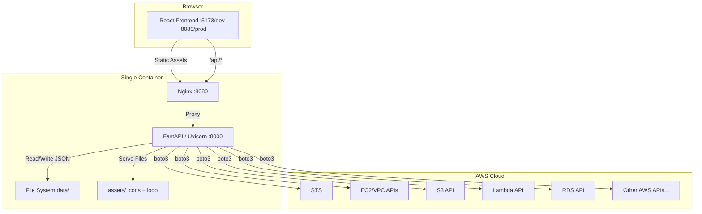
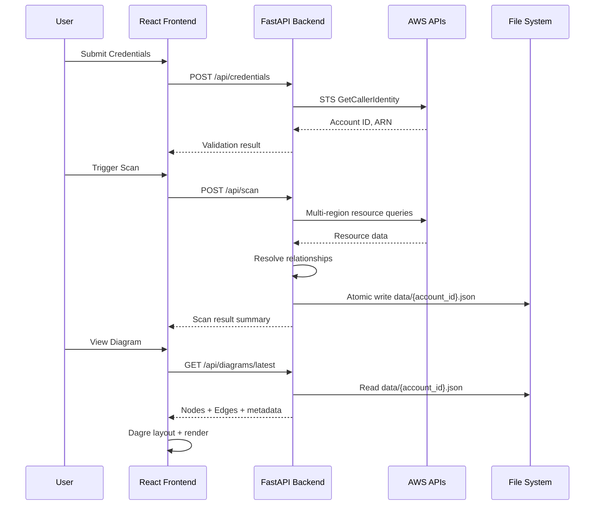

# Design Document: CloudSpyglass

## Overview

CloudSpyglass is a containerized web application that provides developers with an interactive visual map of their AWS infrastructure. The system comprises a React 19 frontend rendered as a node-graph diagram (via @xyflow/react 12 + dagre layout) and a FastAPI backend that handles credential management, multi-region scanning, relationship resolution, and diagram export.

The architecture follows a clear separation of concerns:
- **Frontend**: Single-page application with route-based code splitting, responsible for rendering, filtering, and user interaction.
- **Backend**: Stateless FastAPI services handling AWS API interactions, data processing, and file-based persistence.
- **Deployment**: Single multi-stage Docker image — Nginx serves static assets on port 8080 and proxies `/api/` to uvicorn.

### Key Design Decisions

| Decision | Rationale |
|----------|-----------|
| In-memory credential storage | Security — no credential persistence to disk; cleared on restart |
| File-based scan persistence (`data/{account_id}.json`) | Simplicity — no database required; atomic writes prevent corruption |
| Backend-served icons (not bundled in frontend) | Decouples icon management from frontend builds; enables runtime icon updates |
| Dagre for layout | Battle-tested hierarchical layout algorithm; works well with directed graphs |
| Single container (Nginx + uvicorn) | Simple deployment; no orchestration overhead for single-developer use |

## Architecture



### Request Flow



## Components and Interfaces

### Backend Components

#### 1. Credential Manager (`backend/services/credential_manager.py`)

Manages AWS credential lifecycle: submission, validation, storage, and clearing.

```python
class CredentialManager:
    """In-memory credential store with STS validation."""

    async def set_credentials(self, access_key_id: str, secret_access_key: str,
                              session_token: str | None, region: str) -> CredentialStatus
    async def validate_credentials(self) -> ValidationResult
    async def get_boto3_session(self) -> boto3.Session
    async def clear_credentials(self) -> None
    def get_status(self) -> CredentialStatus
```

#### 2. Scanner (`backend/services/scanner.py`)

Discovers AWS resources across multiple regions with retry logic and timeout handling.

```python
class Scanner:
    """Multi-region AWS resource scanner with exponential backoff."""

    async def scan(self, regions: list[str] | None = None) -> ScanResult
    async def _scan_region(self, region: str) -> RegionScanResult
    async def _scan_resource_type(self, session: boto3.Session,
                                   region: str, resource_type: str) -> list[Resource]
    async def _discover_enabled_regions(self) -> list[str]
```

#### 3. Relationship Resolver (`backend/services/relationship_resolver.py`)

Analyzes scanned resources to detect and categorize connections.

```python
class RelationshipResolver:
    """Detects relationships between AWS resources by configuration analysis."""

    def resolve(self, resources: list[Resource]) -> list[Relationship]
    def _resolve_network_relationships(self, resources: list[Resource]) -> list[Relationship]
    def _resolve_iam_relationships(self, resources: list[Resource]) -> list[Relationship]
    def _resolve_event_relationships(self, resources: list[Resource]) -> list[Relationship]
    def _resolve_data_relationships(self, resources: list[Resource]) -> list[Relationship]
    def _classify_external(self, arn: str, account_id: str) -> bool
```

#### 4. Export Service (`backend/services/export_service.py`)

Generates diagram exports in PDF, PNG, and SVG formats.

```python
class ExportService:
    """Diagram export to PDF, PNG, and SVG with size limits."""

    async def export(self, diagram_data: DiagramData, format: ExportFormat,
                     filters: FilterCriteria | None = None) -> ExportResult
    def _generate_filename(self, account_id: str, format: ExportFormat) -> str
    def _check_size_limit(self, content: bytes) -> None
```

#### 5. Scan Storage (`backend/services/scan_storage.py`)

Handles atomic file I/O for scan results.

```python
class ScanStorage:
    """Atomic file-based persistence for scan results."""

    async def save(self, account_id: str, scan_result: ScanResult) -> None
    async def load(self, account_id: str) -> ScanResult | None
    async def exists(self, account_id: str) -> bool
    def _get_path(self, account_id: str) -> Path
```

#### 6. Filter Engine (`backend/services/filter_engine.py`)

Applies tag and resource-type filters to scan results.

```python
class FilterEngine:
    """Server-side filtering with tag autocomplete support."""

    def apply_filters(self, scan_result: ScanResult,
                      tag_filters: list[TagFilter] | None = None,
                      type_filters: list[str] | None = None) -> FilteredResult
    def get_tag_suggestions(self, scan_result: ScanResult,
                            prefix: str) -> list[TagSuggestion]
```

### Backend API Routes

| Method | Path | Router File | Description |
|--------|------|-------------|-------------|
| POST | `/api/credentials` | `credentials.py` | Submit AWS credentials |
| GET | `/api/credentials/status` | `credentials.py` | Get credential status |
| DELETE | `/api/credentials` | `credentials.py` | Clear credentials |
| POST | `/api/scan` | `scan.py` | Trigger a new scan |
| GET | `/api/scan/status` | `scan.py` | Get scan progress |
| GET | `/api/diagrams/latest` | `diagrams.py` | Get latest diagram data |
| GET | `/api/diagrams/latest/filtered` | `diagrams.py` | Get filtered diagram data |
| GET | `/api/tags/suggestions` | `filters.py` | Get tag autocomplete |
| POST | `/api/export` | `export.py` | Export diagram |
| GET | `/api/settings` | `settings.py` | Get app settings |
| PUT | `/api/settings` | `settings.py` | Update app settings |
| GET | `/api/images/icons/{service_type}` | `images.py` | Get AWS service icon |
| GET | `/api/images/logo` | `images.py` | Get application logo |

### Frontend Components

#### Pages (`src/pages/`)

| File | Route | Purpose |
|------|-------|---------|
| `DiagramPage.tsx` | `/` | Main diagram view with filters and export |
| `SettingsPage.tsx` | `/settings` | Credentials, region selection, auto-refresh config |

#### Components (`src/components/`)

| Component | Responsibility |
|-----------|---------------|
| `DiagramCanvas.tsx` | React Flow canvas wrapper with pan/zoom |
| `ResourceNode.tsx` | Custom node rendering (icon + label + type) |
| `RelationshipEdge.tsx` | Custom edge with color-coding and tooltip |
| `DetailPanel.tsx` | Slide-in resource metadata panel |
| `FilterBar.tsx` | Tag and resource-type filter controls |
| `TagFilterInput.tsx` | Tag key-value input with autocomplete |
| `TypeFilterSelect.tsx` | Multi-select for resource types |
| `ExportMenu.tsx` | Export format selection and trigger |
| `ScanControls.tsx` | Manual refresh + auto-refresh indicator |
| `CredentialForm.tsx` | Credential submission form |
| `RegionSelector.tsx` | Multi-select for AWS regions |
| `EmptyState.tsx` | Empty diagram placeholder |
| `ErrorBanner.tsx` | Global error display |
| `LoadingSpinner.tsx` | Shared loading indicator |
| `AppLogo.tsx` | Logo loaded from /api/images/logo |
| `NavHeader.tsx` | Navigation bar with logo and links |

#### Shared Types (`src/types/`)

| File | Contents |
|------|----------|
| `resources.ts` | Resource, Relationship, ScanResult interfaces |
| `credentials.ts` | CredentialStatus, ValidationResult |
| `filters.ts` | TagFilter, FilterCriteria, FilteredResult |
| `diagram.ts` | DiagramNode, DiagramEdge, LayoutConfig |
| `export.ts` | ExportFormat, ExportRequest, ExportResult |
| `settings.ts` | AppSettings, AutoRefreshInterval |
| `errors.ts` | ErrorResponse (mirrors backend structure) |

## Data Models

### Backend Pydantic Models

```python
# === Credentials ===

class CredentialSubmission(BaseModel):
    access_key_id: str = Field(..., max_length=128)
    secret_access_key: str = Field(..., max_length=128)
    session_token: str | None = Field(None, max_length=1024)
    region: str

class CredentialStatus(BaseModel):
    connected: bool
    account_id: str | None = None
    credential_source: Literal["ui", "boto3_chain"] | None = None
    expiry: str | None = None  # ISO 8601 or "No expiration"
    status: Literal["Connected", "Disconnected", "Expired"]

class ValidationResult(BaseModel):
    valid: bool
    account_id: str | None = None
    arn: str | None = None
    error: str | None = None


# === Resources ===

class Resource(BaseModel):
    arn: str
    resource_type: str  # e.g., "ec2", "lambda", "s3"
    name: str
    region: str
    tags: dict[str, str] = {}
    creation_date: str | None = None  # ISO 8601
    iam_role: str | None = None
    attributes: dict[str, Any] = {}  # service-specific metadata
    is_external: bool = False
    is_unresolved: bool = False


class Relationship(BaseModel):
    source_arn: str
    target_arn: str
    category: Literal["network", "iam", "event", "data"]
    derived_from: str  # configuration property name


# === Scan ===

class ScanRequest(BaseModel):
    regions: list[str] | None = None  # None = all enabled regions

class RegionFailure(BaseModel):
    region: str
    resource_type: str
    error_message: str
    timestamp: str  # ISO 8601

class ScanResult(BaseModel):
    account_id: str
    scan_timestamp: str  # ISO 8601
    resources: list[Resource]
    relationships: list[Relationship]
    failures: list[RegionFailure] = []
    scanned_regions: list[str]
    total_scan_duration_ms: int


# === Diagram ===

class DiagramNode(BaseModel):
    id: str  # ARN
    resource_type: str
    name: str
    region: str
    is_external: bool = False
    is_unresolved: bool = False
    icon_url: str  # /api/images/icons/{service_type}

class DiagramEdge(BaseModel):
    id: str  # source_arn + target_arn hash
    source: str  # source ARN
    target: str  # target ARN
    category: Literal["network", "iam", "event", "data"]
    derived_from: str
    label: str | None = None

class DiagramData(BaseModel):
    nodes: list[DiagramNode]
    edges: list[DiagramEdge]
    account_id: str
    scan_timestamp: str
    total_resources: int
    scanned_regions: list[str]
    failures: list[RegionFailure] = []


# === Filters ===

class TagFilter(BaseModel):
    key: str = Field(..., max_length=128)
    value: str = Field(..., max_length=256)

class FilterCriteria(BaseModel):
    tag_filters: list[TagFilter] = Field(default_factory=list, max_length=10)
    type_filters: list[str] = []

class FilteredResult(BaseModel):
    diagram: DiagramData
    filtered_count: int
    total_count: int
    active_filters: FilterCriteria

class TagSuggestion(BaseModel):
    key: str
    value: str
    count: int


# === Export ===

class ExportFormat(str, Enum):
    PDF = "pdf"
    PNG = "png"
    SVG = "svg"

class ExportRequest(BaseModel):
    format: ExportFormat
    filters: FilterCriteria | None = None

class ExportResult(BaseModel):
    filename: str
    format: ExportFormat
    size_bytes: int
    path: str


# === Settings ===

class AutoRefreshInterval(str, Enum):
    ONE_MIN = "1m"
    FIVE_MIN = "5m"
    FIFTEEN_MIN = "15m"
    THIRTY_MIN = "30m"
    SIXTY_MIN = "60m"
    MANUAL = "manual"

class AppSettings(BaseModel):
    auto_refresh_interval: AutoRefreshInterval = AutoRefreshInterval.MANUAL
    selected_regions: list[str] = []  # Empty = all enabled regions


# === Errors ===

class ErrorResponse(BaseModel):
    error_code: str  # UPPER_SNAKE_CASE
    message: str = Field(..., max_length=500)
    details: str | None = None
    timestamp: str  # ISO 8601 UTC
    recoverable: bool
```

### Scan Result File Schema (`data/{account_id}.json`)

The file stores a serialized `ScanResult` Pydantic model as UTF-8 JSON:

```json
{
  "account_id": "123456789012",
  "scan_timestamp": "2024-01-15T10:30:00Z",
  "resources": [
    {
      "arn": "arn:aws:ec2:us-east-1:123456789012:instance/i-abc123",
      "resource_type": "ec2",
      "name": "web-server-01",
      "region": "us-east-1",
      "tags": { "Environment": "production", "Team": "platform" },
      "creation_date": "2023-06-01T08:00:00Z",
      "iam_role": "arn:aws:iam::123456789012:role/EC2WebRole",
      "attributes": { "instance_type": "t3.medium", "state": "running" },
      "is_external": false,
      "is_unresolved": false
    }
  ],
  "relationships": [
    {
      "source_arn": "arn:aws:ec2:us-east-1:123456789012:instance/i-abc123",
      "target_arn": "arn:aws:ec2:us-east-1:123456789012:security-group/sg-xyz789",
      "category": "network",
      "derived_from": "SecurityGroups"
    }
  ],
  "failures": [],
  "scanned_regions": ["us-east-1", "us-west-2", "eu-west-1"],
  "total_scan_duration_ms": 45230
}
```

### Frontend TypeScript Interfaces

```typescript
// src/types/resources.ts
export interface Resource {
  arn: string;
  resource_type: string;
  name: string;
  region: string;
  tags: Record<string, string>;
  creation_date: string | null;
  iam_role: string | null;
  attributes: Record<string, unknown>;
  is_external: boolean;
  is_unresolved: boolean;
}

export interface Relationship {
  source_arn: string;
  target_arn: string;
  category: "network" | "iam" | "event" | "data";
  derived_from: string;
}

export interface ScanResult {
  account_id: string;
  scan_timestamp: string;
  resources: Resource[];
  relationships: Relationship[];
  failures: RegionFailure[];
  scanned_regions: string[];
  total_scan_duration_ms: number;
}

export interface RegionFailure {
  region: string;
  resource_type: string;
  error_message: string;
  timestamp: string;
}

// src/types/diagram.ts
export interface DiagramNode {
  id: string;
  resource_type: string;
  name: string;
  region: string;
  is_external: boolean;
  is_unresolved: boolean;
  icon_url: string;
}

export interface DiagramEdge {
  id: string;
  source: string;
  target: string;
  category: "network" | "iam" | "event" | "data";
  derived_from: string;
  label: string | null;
}

// src/types/errors.ts
export interface ErrorResponse {
  error_code: string;
  message: string;
  details: string | null;
  timestamp: string;
  recoverable: boolean;
}
```

### Relationship Detection Rules

| Category | Source | Target | Derived From |
|----------|--------|--------|--------------|
| network | EC2 Instance | Security Group | `SecurityGroups[].GroupId` |
| network | EC2 Instance | VPC | `VpcId` |
| network | EC2 Instance | Subnet | `SubnetId` |
| network | RDS Instance | VPC | `DBSubnetGroup.VpcId` |
| network | Lambda Function | VPC | `VpcConfig.VpcId` |
| network | Lambda Function | Subnet | `VpcConfig.SubnetIds[]` |
| network | ALB/NLB | Target (EC2/ECS) | `TargetGroups[].Targets[]` |
| network | ALB/NLB | VPC | `VpcId` |
| iam | EC2 Instance | IAM Role | `IamInstanceProfile.Arn` |
| iam | Lambda Function | IAM Role | `Role` |
| iam | ECS Service | IAM Role | `TaskDefinition.TaskRoleArn` |
| event | SQS Queue | Lambda | `EventSourceMappings[].EventSourceArn` |
| event | SNS Topic | Lambda | `Subscriptions[].Endpoint` |
| event | S3 Bucket | Lambda/SQS/SNS | `NotificationConfiguration` |
| data | RDS Instance | Subnet | `DBSubnetGroup.Subnets[].SubnetIdentifier` |

### Edge Styling Rules

| Category | Color | Style | Animation |
|----------|-------|-------|-----------|
| network | Blue (`#2563eb`) | Solid | None |
| iam | Green (`#16a34a`) | Dashed | None |
| event | Orange (`#ea580c`) | Dotted | Animated flow |
| data | Gray (`#6b7280`) | Solid | None |

## Correctness Properties

*A property is a characteristic or behavior that should hold true across all valid executions of a system — essentially, a formal statement about what the system should do. Properties serve as the bridge between human-readable specifications and machine-verifiable correctness guarantees.*

### Property 1: Credential submission validation

*For any* credential payload, if the `access_key_id` or `secret_access_key` field is empty or composed entirely of whitespace characters, the system SHALL reject the submission and return an error; otherwise, if both fields contain at least one non-whitespace character, the system SHALL accept and store the credentials.

**Validates: Requirements 1.2, 1.6**

### Property 2: Credential replacement

*For any* sequence of valid credential submissions, the `get_boto3_session()` method SHALL always return a session configured with the most recently submitted credentials, and no previously submitted credential SHALL remain active.

**Validates: Requirements 1.4**

### Property 3: Credential error categorization

*For any* credential validation failure (invalid keys, expired session, unreachable endpoint), the error response SHALL contain a descriptive `message` field indicating the specific failure reason and SHALL conform to the standard error response structure.

**Validates: Requirements 2.3**

### Property 4: Region selection scan targeting

*For any* subset of valid AWS region codes (including the empty set), the Scanner SHALL target exactly those regions for scanning; if the subset is empty, the Scanner SHALL discover and target all enabled regions.

**Validates: Requirements 3.1**

### Property 5: Exponential backoff calculation

*For any* retry attempt number `n` (1 through 5), the computed delay SHALL equal `min(2^(n-1), 30)` seconds, starting at 1 second for the first retry.

**Validates: Requirements 3.4**

### Property 6: Partial region failure handling

*For any* set of regions where some succeed and some fail, the ScanResult SHALL contain all resources from successful regions AND a `failures` list entry for each failed region containing the region name, resource type, error message, and timestamp.

**Validates: Requirements 3.5**

### Property 7: Network relationship detection

*For any* set of resources containing EC2 instances with SecurityGroup/VPC/Subnet references, RDS instances with VPC/Subnet configurations, Lambda functions with VpcConfig, or Load Balancers with targets, the RelationshipResolver SHALL produce a relationship record for each detected connection with `category: "network"` and the correct `derived_from` property name.

**Validates: Requirements 4.1**

### Property 8: IAM relationship detection

*For any* set of resources containing Lambda functions, EC2 instances, or ECS services with IAM role associations, the RelationshipResolver SHALL produce a relationship record for each role attachment with `category: "iam"`.

**Validates: Requirements 4.2**

### Property 9: Event relationship detection

*For any* set of resources containing SQS-to-Lambda event source mappings, SNS-to-Lambda subscriptions, or S3 event notifications, the RelationshipResolver SHALL produce a relationship record for each event connection with `category: "event"`.

**Validates: Requirements 4.3**

### Property 10: External component classification

*For any* ARN reference found in resource configurations, if the embedded Account_ID differs from the scanned account OR the referenced hostname does not match `*.amazonaws.com`, the system SHALL classify that target as an external component.

**Validates: Requirements 4.5**

### Property 11: Unresolved target preservation

*For any* relationship where the target ARN is not present in the current scan results, the RelationshipResolver SHALL still record the relationship AND mark the target resource as `is_unresolved: true`.

**Validates: Requirements 4.7**

### Property 12: Edge styling by category

*For any* relationship category, the Diagram_Renderer SHALL apply the correct visual style: blue solid for network, green dashed for iam, orange dotted animated for event, and gray solid for data.

**Validates: Requirements 5.3**

### Property 13: Detail panel metadata completeness

*For any* resource of a given type, when selected, the Detail_Panel SHALL display all metadata fields applicable to that resource type (ARN, region, tags, creation_date, iam_role, type-specific attributes) and SHALL omit sections for fields not applicable to the resource type.

**Validates: Requirements 6.1**

### Property 14: Tag filter AND logic with edge filtering

*For any* set of resources with tags and any combination of up to 10 tag key-value filters, the filtered result SHALL contain only resources matching ALL specified tag criteria, and SHALL include only edges where BOTH endpoints are in the filtered resource set. The `filtered_count` SHALL equal the number of resources in the filtered set and SHALL be less than or equal to `total_count`.

**Validates: Requirements 7.1, 7.3, 7.4**

### Property 15: Tag autocomplete frequency ordering

*For any* scan result containing tagged resources, the tag suggestion list SHALL return at most 20 entries ordered by descending frequency of occurrence in the current scan data.

**Validates: Requirements 7.2**

### Property 16: Filter removal round-trip

*For any* diagram data, applying tag/type filters and then removing all filters SHALL produce a result equivalent to the original unfiltered diagram.

**Validates: Requirements 7.6**

### Property 17: Resource type filter available options

*For any* ScanResult, the set of available resource type filter options SHALL exactly equal the set of distinct `resource_type` values present in the scan data.

**Validates: Requirements 8.1**

### Property 18: Resource type OR logic with edge visibility

*For any* set of selected resource types, the filtered result SHALL contain all resources matching ANY of the selected types, plus any edge where at least one endpoint is a resource of a selected type.

**Validates: Requirements 8.2**

### Property 19: Combined filter intersection

*For any* combination of active tag filters and active resource type filters, the result SHALL contain only resources that satisfy ALL tag filters AND match at least one selected resource type.

**Validates: Requirements 8.5**

### Property 20: Diagram state preservation on refresh failure

*For any* current diagram state, if an auto-refresh scan fails, the diagram data SHALL remain unchanged from its pre-refresh state.

**Validates: Requirements 9.4**

### Property 21: Scan result persistence round-trip

*For any* valid ScanResult object, serializing it to `data/{account_id}.json` and then deserializing the file SHALL produce an object equivalent to the original.

**Validates: Requirements 10.1**

### Property 22: Single file per account invariant

*For any* sequence of scan saves for the same Account_ID, exactly one file SHALL exist at `data/{account_id}.json` at any point in time.

**Validates: Requirements 10.3**

### Property 23: Write failure preserves previous file

*For any* failed write operation, the previously saved `data/{account_id}.json` file SHALL remain unchanged and readable.

**Validates: Requirements 10.5**

### Property 24: Corrupt file graceful handling

*For any* file content at `data/{account_id}.json` that is not valid UTF-8 JSON or does not conform to the ScanResult schema, the system SHALL discard it and return no scan data (empty state).

**Validates: Requirements 10.6**

### Property 25: Export filename format

*For any* Account_ID and export timestamp, the generated filename SHALL match the pattern `{Account_ID}_{YYYYMMDD_HHmmss}.{format}` where the timestamp is in UTC.

**Validates: Requirements 11.3**

### Property 26: Export size limit enforcement

*For any* export operation that would produce output exceeding 50 MB, the system SHALL reject the request and return an error without producing any file.

**Validates: Requirements 11.6**

### Property 27: Filtered export annotation

*For any* export performed while filters are active, the exported document SHALL contain only the filtered resources and SHALL include a text annotation describing the active filter criteria.

**Validates: Requirements 11.2**

### Property 28: Icon endpoint correctness

*For any* valid `service_type` string corresponding to a supported Scanner resource type where an SVG file exists in `assets/icons/`, the GET `/api/images/icons/{service_type}` endpoint SHALL return the file content with `Content-Type: image/svg+xml`.

**Validates: Requirements 13.2**

### Property 29: Icon error handling

*For any* `service_type` parameter that does not match a known resource type, the endpoint SHALL return HTTP 400; for any valid `service_type` where the SVG file is missing from `assets/icons/`, the endpoint SHALL return HTTP 404. Both responses SHALL conform to the standard error structure.

**Validates: Requirements 13.6, 13.7**

### Property 30: Error response structure invariant

*For any* error response returned by any CloudSpyglass API endpoint, the JSON body SHALL contain exactly these fields: `error_code` (string, UPPER_SNAKE_CASE), `message` (string, ≤500 characters), `details` (string or null), `timestamp` (ISO 8601 UTC string), and `recoverable` (boolean).

**Validates: Requirements 14.1**

### Property 31: Error recoverability classification

*For any* error caused by a transient condition (network timeout, AWS throttling, temporary unavailability), `recoverable` SHALL be `true`; for any error caused by a permanent condition (invalid input, missing fields, authentication failure), `recoverable` SHALL be `false`.

**Validates: Requirements 14.2, 14.3**

## Error Handling

### Error Classification Strategy

All errors are classified into two categories that determine the `recoverable` flag:

| Condition Type | Examples | `recoverable` | Frontend Action |
|---------------|----------|---------------|-----------------|
| Transient | Network timeout, AWS throttling, service unavailable | `true` | Show warning, auto-retry eligible |
| Permanent | Invalid input, auth failure, missing required fields | `false` | Show error, user action required |

### Error Code Registry

| Error Code | HTTP Status | Meaning |
|-----------|-------------|---------|
| `INVALID_CREDENTIALS` | 400 | Missing or malformed credential fields |
| `CREDENTIAL_VALIDATION_FAILED` | 401 | STS rejected credentials |
| `CREDENTIALS_EXPIRED` | 401 | Session token expired |
| `NO_CREDENTIALS` | 401 | No credentials configured |
| `SCAN_IN_PROGRESS` | 409 | A scan is already running |
| `SCAN_TIMEOUT` | 504 | Total scan exceeded 10-minute limit |
| `REGION_SCAN_FAILED` | 502 | One or more regions failed during scan |
| `AWS_THROTTLED` | 429 | AWS API rate limit hit (after retries exhausted) |
| `NETWORK_ERROR` | 502 | Unable to reach AWS endpoint |
| `STORAGE_WRITE_FAILED` | 500 | Failed to persist scan result to disk |
| `STORAGE_READ_FAILED` | 500 | Failed to read persisted scan result |
| `EXPORT_FAILED` | 500 | Export generation failed |
| `EXPORT_TOO_LARGE` | 413 | Export would exceed 50 MB limit |
| `EXPORT_TIMEOUT` | 504 | Export exceeded 30-second limit |
| `ICON_NOT_FOUND` | 404 | Icon file not found in assets/icons/ |
| `INVALID_SERVICE_TYPE` | 400 | service_type not in known resource types |
| `INVALID_FILTER` | 400 | Filter criteria exceeds limits or is malformed |
| `VALIDATION_ERROR` | 422 | Request body failed Pydantic validation |

### Backend Error Handling Pattern

```python
from datetime import datetime, timezone

class CloudSpyglassError(Exception):
    def __init__(self, error_code: str, message: str,
                 details: str | None = None, recoverable: bool = False,
                 status_code: int = 500):
        self.error_code = error_code
        self.message = message
        self.details = details
        self.recoverable = recoverable
        self.status_code = status_code

# FastAPI exception handler
@app.exception_handler(CloudSpyglassError)
async def cloudspyglass_error_handler(request, exc: CloudSpyglassError):
    return JSONResponse(
        status_code=exc.status_code,
        content=ErrorResponse(
            error_code=exc.error_code,
            message=exc.message,
            details=exc.details,
            timestamp=datetime.now(timezone.utc).isoformat(),
            recoverable=exc.recoverable,
        ).model_dump(),
    )
```

### Frontend Error Handling

- All API calls go through a shared `apiClient` utility that catches non-2xx responses and parses them into `ErrorResponse` objects.
- Recoverable errors display as dismissible warning banners with an optional "Retry" button.
- Non-recoverable errors display as persistent error banners requiring user action.
- Network failures (fetch throws) are wrapped as transient errors with `recoverable: true`.

## Testing Strategy

### Test Framework Stack

| Layer | Framework | Purpose |
|-------|-----------|---------|
| Backend unit/property | pytest + hypothesis | Property-based + example-based testing |
| Backend integration | pytest + moto + httpx | AWS mocking + API endpoint testing |
| Backend async | pytest-asyncio | Async service testing |
| Frontend unit/property | Vitest + fast-check | Property-based + example-based testing |
| Frontend component | @testing-library/react | Component rendering tests |

### Property-Based Testing Configuration

**Backend (hypothesis)**:
- Minimum 100 examples per property test (via `@settings(max_examples=100)`)
- Each test tagged with a comment: `# Feature: cloudspyglass, Property {N}: {title}`
- Custom strategies for generating Resources, ScanResults, Relationships, and filter criteria

**Frontend (fast-check)**:
- Minimum 100 runs per property test (via `fc.assert(property, { numRuns: 100 })`)
- Each test tagged with: `// Feature: cloudspyglass, Property {N}: {title}`
- Custom arbitraries for DiagramNode, DiagramEdge, and filter objects

### Test Distribution

| Category | Coverage Focus |
|----------|---------------|
| Property tests (backend) | Filter logic, relationship resolution, credential validation, file I/O round-trips, error classification, exponential backoff |
| Property tests (frontend) | Filter UI logic, edge styling mapping, tag suggestion ordering |
| Unit tests (backend) | Specific resource type scanning, individual relationship rules, filename generation |
| Unit tests (frontend) | Component rendering, user interactions, empty states |
| Integration tests (backend) | Full scan flow with moto, API endpoint contracts, file atomicity |
| Integration tests (frontend) | Page-level flows, API integration with MSW |

### Key Test Files

**Backend:**
- `tests/properties/test_filter_properties.py` — Properties 14, 15, 16, 17, 18, 19
- `tests/properties/test_relationship_properties.py` — Properties 7, 8, 9, 10, 11
- `tests/properties/test_credential_properties.py` — Properties 1, 2, 3
- `tests/properties/test_scan_properties.py` — Properties 4, 5, 6
- `tests/properties/test_storage_properties.py` — Properties 21, 22, 23, 24
- `tests/properties/test_export_properties.py` — Properties 25, 26, 27
- `tests/properties/test_error_properties.py` — Properties 30, 31
- `tests/properties/test_icon_properties.py` — Properties 28, 29

**Frontend:**
- `src/__tests__/properties/filter.property.test.ts` — Properties 14, 16, 17, 18, 19
- `src/__tests__/properties/edge-styling.property.test.ts` — Property 12
- `src/__tests__/properties/tag-suggestions.property.test.ts` — Property 15

### Dual Testing Balance

- **Property tests** cover universal invariants (filtering logic, serialization round-trips, error structure, relationship detection rules) — these are the correctness backbone.
- **Unit tests** cover specific examples, edge cases, and error conditions that help pinpoint failures (e.g., a specific malformed ARN, a specific resource type's scanning logic).
- **Integration tests** cover end-to-end flows where mocking would hide real bugs (full scan with moto, API contract verification, file system atomicity).

