# CloudSpyglass User Guide

CloudSpyglass is an AWS infrastructure visualization tool that scans your AWS account, discovers resources and their relationships, and renders an interactive architecture diagram in your browser.

---

## 1. The Diagram Panel

When you first open CloudSpyglass, you land on the **Diagram** panel. This is the main workspace where your architecture diagrams will be displayed.

Initially, the canvas is empty and shows the message: *"No scan data available. Click 'Scan' above to discover your AWS infrastructure."*

The top navigation bar contains:
- **Language selector** (top-right globe icon)
- **Diagram** / **Settings** tabs to switch between views
- **Region selector** dropdown to choose which AWS regions to scan
- **Scan** button to start discovering your infrastructure

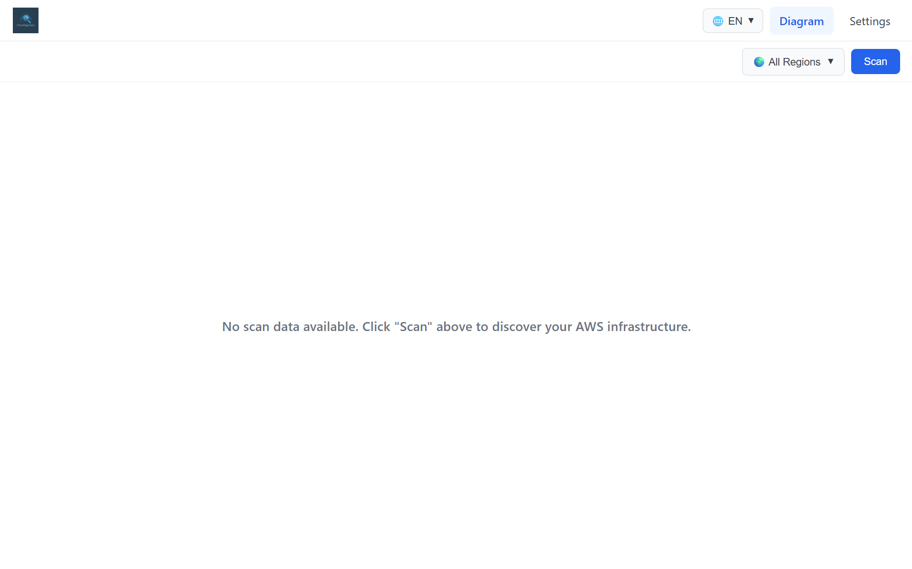

---

## 2. Changing the Language

CloudSpyglass supports multiple languages. Click the **language dropdown** (globe icon with "EN") in the top-right corner to switch between:

- English
- Español
- Português

The entire interface will update to reflect your language choice.

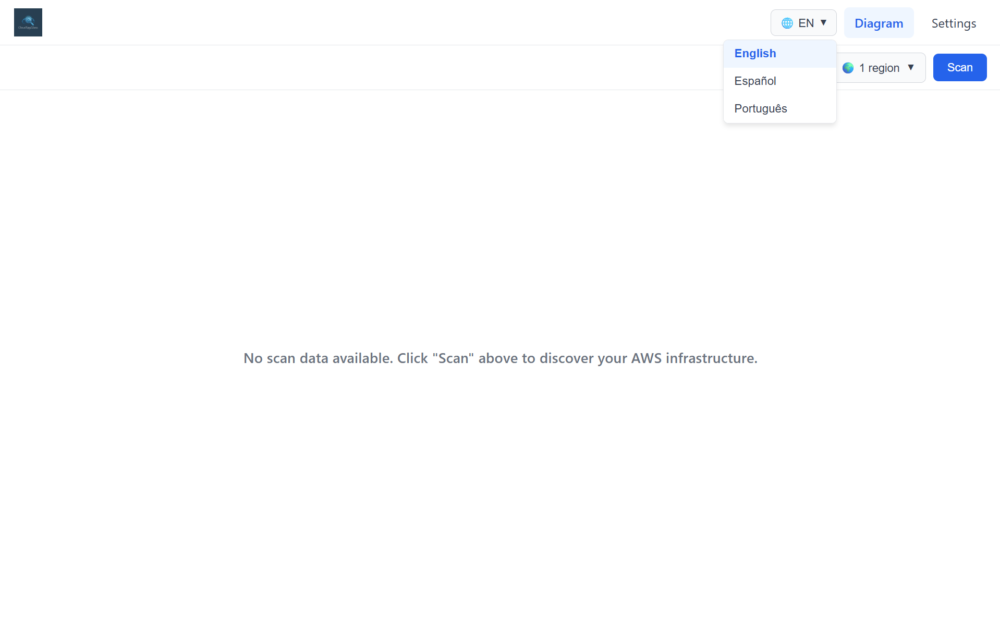

---

## 3. Setting Up AWS Credentials

Before scanning, you need to connect your AWS account. Navigate to the **Settings** tab to configure your credentials.

### Connecting Your Account

In the **AWS Credentials** section, fill in:

1. **Access Key ID** — your AWS access key
2. **Secret Access Key** — your AWS secret key
3. **Session Token** (optional) — required if you're using temporary credentials (e.g., from AWS STS)

Click the **Connect** button to authenticate. The **Credential Status** card at the top will show the current connection state.

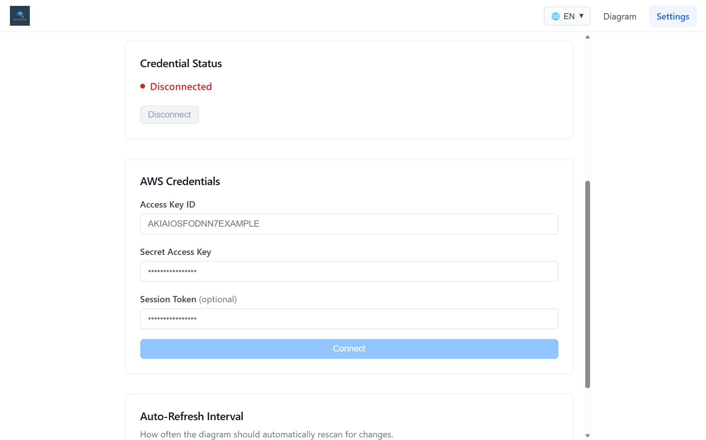

### Successful Connection

Once connected, the status changes to **Connected** (green indicator) and displays:
- **Account ID** — the AWS account number
- **Source** — how the credentials were provided (e.g., "UI-provided")
- **Expiry** — credential expiration info

You can click **Disconnect** at any time to remove the stored credentials.

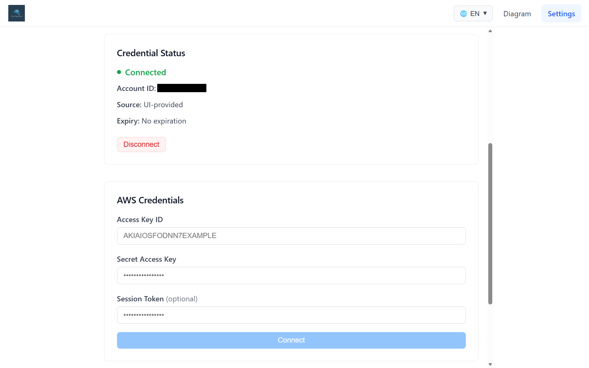

---

## 4. Auto-Refresh

Below the credentials section in **Settings**, you'll find the **Auto-Refresh Interval** setting. This controls how often CloudSpyglass automatically re-scans your AWS account to detect infrastructure changes.

Available intervals:
- **Manual** (default) — no automatic rescanning; you trigger scans manually
- **1 minute**
- **5 minutes**
- **15 minutes**
- **30 minutes**
- **60 minutes**

Select the interval that fits your workflow. For actively changing environments, shorter intervals keep your diagram current. For stable infrastructure, manual mode avoids unnecessary API calls.

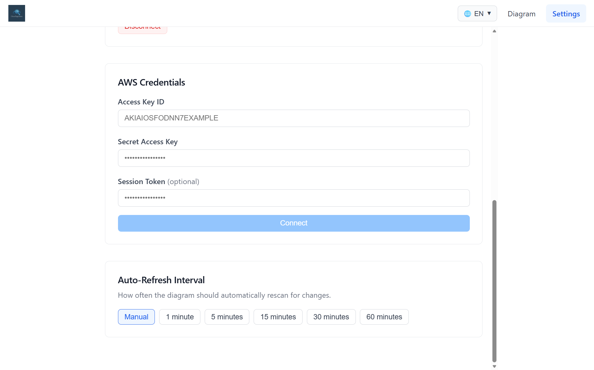

---

## 5. Selecting Regions

Before scanning, you can limit the discovery to specific AWS regions. Click the **region dropdown** (shows "All Regions" by default) next to the Scan button.

A checklist appears with all available AWS regions. Select one or more regions to narrow the scan scope. The dropdown label updates to show how many regions are selected (e.g., "1 region").

Use **Clear all** to deselect everything, or leave all unchecked to scan all regions.

Limiting regions speeds up the scan and focuses the diagram on the infrastructure you care about.

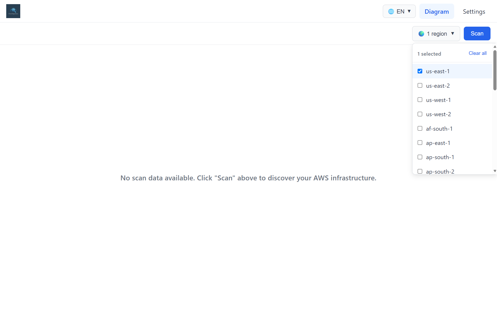

---

## 6. Scanning and Viewing Your Architecture

### Starting a Scan

Click the **Scan** button to begin discovering resources. During the scan:
- The button changes to **"Scanning..."** with a loading spinner
- A timer shows elapsed time
- A **Stop** button appears if you need to cancel

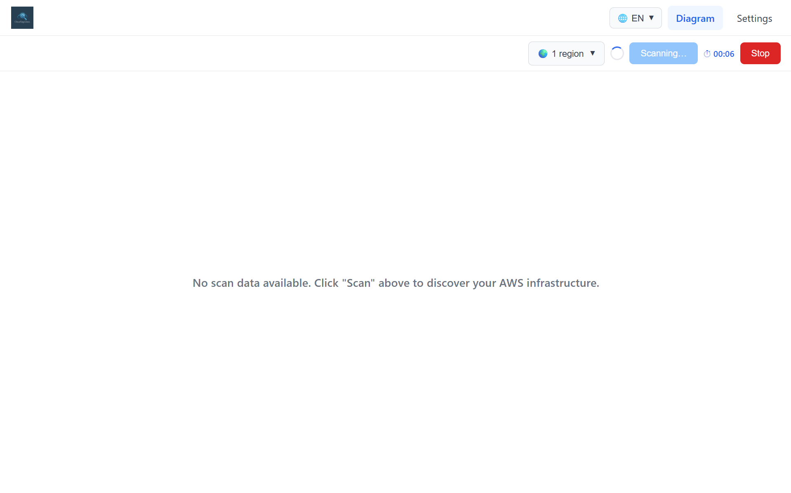

### Viewing the Architecture Diagram

Once the scan completes, your AWS infrastructure is rendered as an interactive diagram. Resources are organized hierarchically:
- **AWS Cloud** → **Account** → **Region** → **Availability Zone** → **VPC** → **Subnet** → individual resources

The diagram is fully interactive — you can **pan** (click and drag the canvas), **zoom** (scroll wheel), and use the **Fit View** button to auto-fit the entire diagram in the viewport. Zoom controls (+/-) are available in the bottom-left corner.

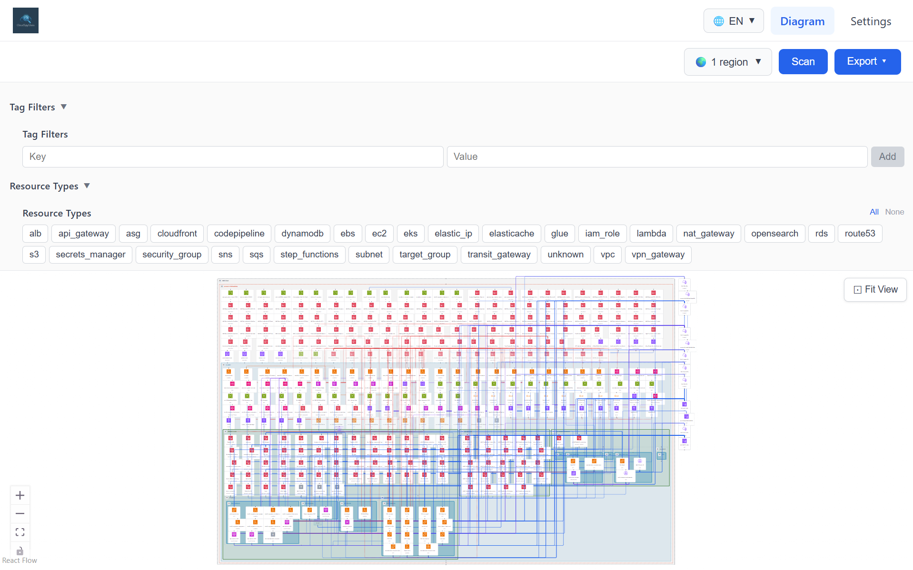

### Inspecting Resources

Click on any resource node in the diagram to open a **detail panel** on the right side. This panel shows:
- **Identifiers** — ARN and resource ID
- **Region** — where the resource is located
- **Name** — the resource name
- **Tags** — all AWS tags attached to the resource
- **Creation Date** — when the resource was created
- **Attributes** — service-specific details (e.g., engine type and version for ElastiCache)

Close the panel by clicking the **X** button.

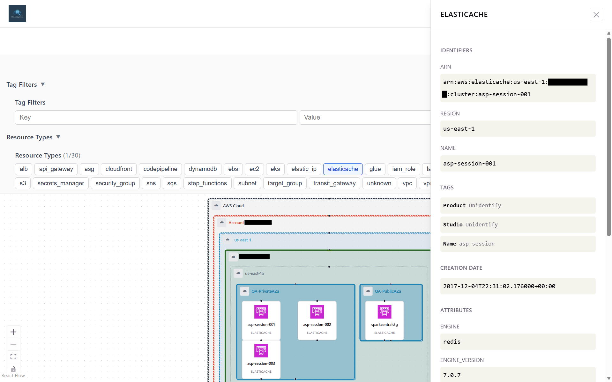

---

## 7. Filtering Resources

After a scan, CloudSpyglass provides two filtering mechanisms to focus on what matters. The filter panels are collapsible — click the triangle icon to expand or collapse them.

### Resource Type Filter

The **Resource Types** section displays all discovered service types as clickable chips (e.g., `ec2`, `s3`, `lambda`, `rds`). Click a specific type to show only resources of that kind. The counter updates to reflect how many resources are visible (e.g., "4 of 399 resources").

Use **All** to show everything or **None** to hide all, then selectively enable types. A **Clear All** link resets all filters.

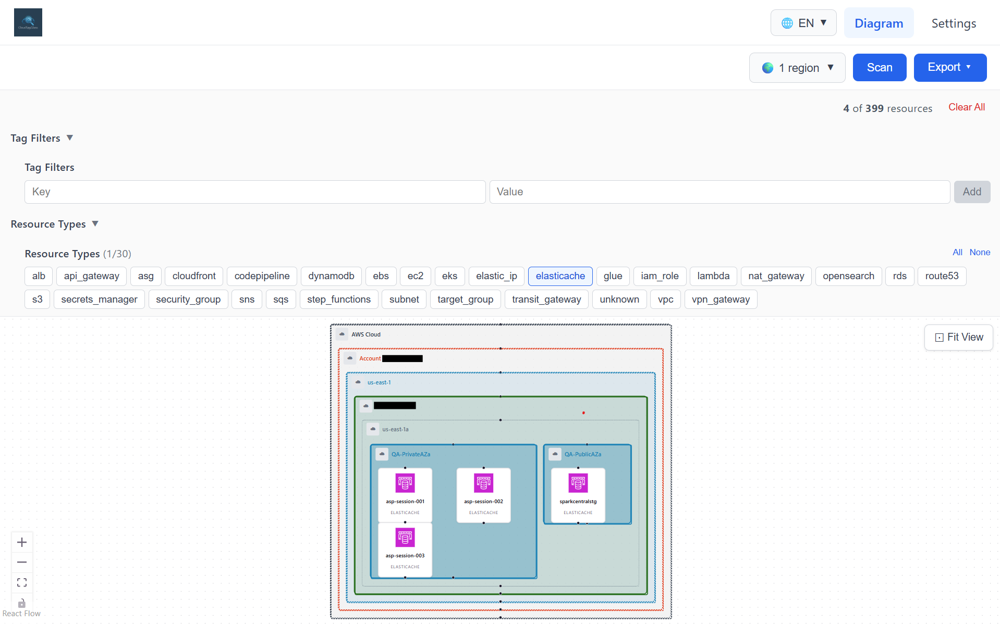

### Tag Filters

The **Tag Filters** section lets you filter resources by their AWS tags. Enter a **Key** and **Value**, then click **Add** to apply the filter. Only resources matching all specified tag key-value pairs will be shown (AND logic).

This is useful for isolating resources by environment (e.g., `Environment: production`), team, project, or any custom tagging strategy you use.

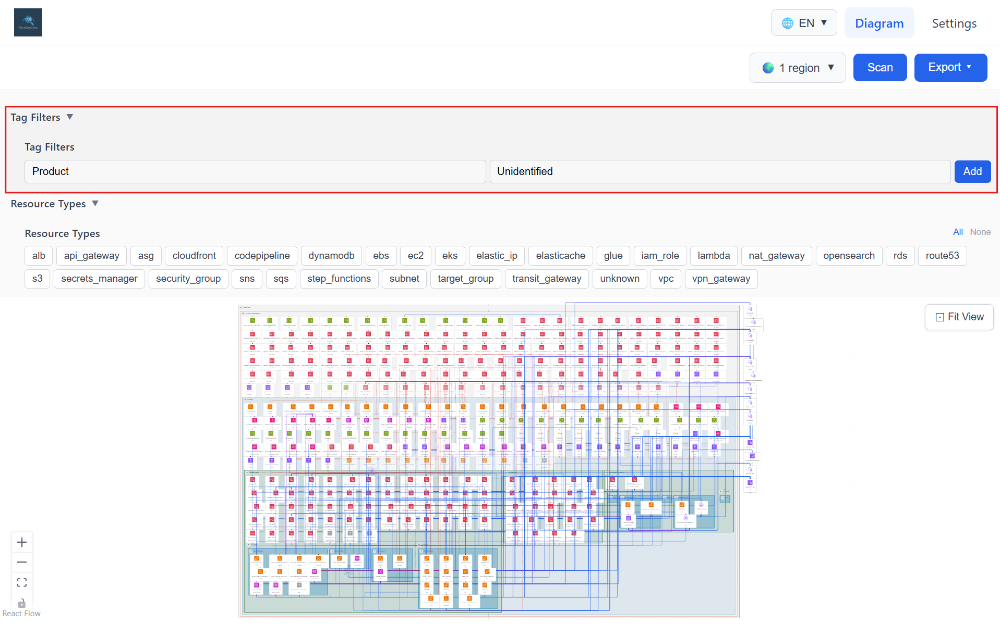

---

## 8. Exporting Your Diagram

Once you have your diagram configured and filtered to your liking, click the **Export** button (top-right, purple) to download it. Three formats are available:

- **PDF** — multi-page document, ideal for sharing and printing
- **PNG (300 DPI)** — high-resolution image, great for presentations and documentation
- **SVG** — scalable vector format, perfect for embedding in web pages or further editing

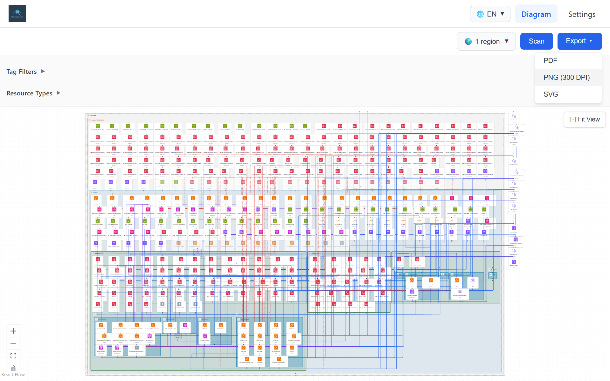
